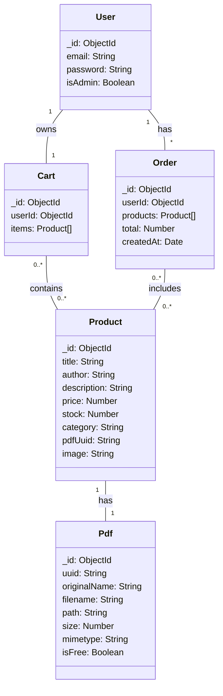

# My Drum Books E-Shop

This is a full-stack web application for selling PDF drum books. It features a product catalog, user authentication, shopping cart functionality, and an order system. The entire application is containerized with Docker for easy deployment and scalability.

## Features

- View and search a catalog of drum books.
- User registration and authentication.
- Add products to a shopping cart.
- Simple checkout and order placement.
- Automated database cleanup on startup.
- RESTful backend API with Swagger documentation.

## Technology Stack

- **Frontend:** Angular, TypeScript, SCSS, Bootstrap
- **Backend:** Node.js, Express.js, TypeScript
- **Database:** MongoDB
- **Web Server (Frontend):** Nginx
- **Containerization:** Docker, Docker Compose
- **API Documentation:** Swagger UI

## Deployment Instructions

To get the project running, you need to have Docker and Docker Compose installed on your machine.

1.  **Clone the repository:**
    ```shell
    git clone <your-repository-url>
    cd my-eshop-app
    ```

2.  **Build and Run with Docker Compose:**
    From the project's root directory, run the following command. This will build the frontend and backend images, start all services, and run them in the background.

    ```shell
    docker-compose up --build -d
    ```

3.  **Access the Application:**
    - The **frontend** will be available at [http://localhost](http://localhost).
    - The **backend API** is accessible at `http://localhost:3000`.
    - **API Documentation** (Swagger) is available at [http://localhost:3000/api-docs](http://localhost:3000/api-docs).

## Usage

### Uploading a New PDF Book

To add a new book to the shop, you can upload a PDF using the backend API. The upload process automatically creates both the `PDF` entry and the associated `Product` entry in the database.

You can use a tool like `curl` or Postman. Here is an example using `curl`:

```shell
curl -X POST http://localhost:3000/api/pdf/upload \
  -F "file=@/path/to/your/book.pdf" \
  -F "title=My Awesome Drum Book" \
  -F "author=John Doe" \
  -F "price=19.99"
```

Replace `/path/to/your/book.pdf` with the actual path to your file. The new product will immediately appear in the shop.

## System Architecture

### Dataflow Diagrams

#### 1. User Viewing Products & Thumbnails

This diagram shows how a user's request for the product list is processed.

```mermaid
graph TD
    A[Browser] -- 1. GET / --> B{Nginx (Frontend)};
    B -- 2. Serves --> C[Static Files (Angular App)];
    C -- 3. (Angular App loaded) GET /api/products --> D[Browser];
    D -- 4. GET /api/products --> E{Backend (NodeJS)};
    E -- 5. find() --> F[MongoDB];
    F -- 6. returns data --> E;
    E -- 8. JSON (products) --> D;
    D -- 7. (Angular App renders list) GET /api/pdf/view/:uuid --> E;
    E -- 10. findOne() --> F;
    F -- 11. returns path --> E;
    E -- 12. Serves PDF file --> D;
```

#### 2. Admin Uploading a PDF

This diagram shows the process for uploading a new PDF and creating a product.

```mermaid
graph TD
    A[Client (curl)] -- 1. POST /api/pdf/upload --> B{Backend (NodeJS)};
    B -- 2. Saves file to volume (Multer Middleware) --> C[Volume (uploads)];
    B -- 3. Creates PDF & Product records --> D[MongoDB];
```

### Database Models

Here is a simplified representation of the main database entities and their relationships.



## Primary Use Cases

- **Guest:** Can view the list of all available books and their details.
- **User:**
  - Can register for a new account.
  - Can log in and log out.
  - Can add or remove books from their shopping cart.
  - Can view their cart.
  - Can place an order from the items in their cart.
- **Admin:**
  - Can upload a new PDF file via the API, which creates a new product for sale.
"# my-eshop-app" 
